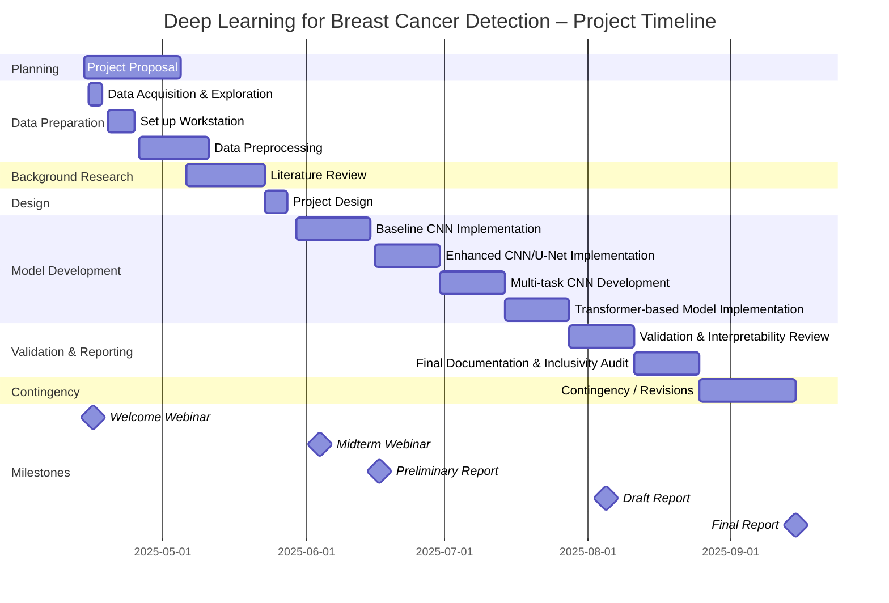

# Final Project: Deep Learning for Breast Cancer Detection

## Timeline

| Date        | Week   | Deliverable                       | Weight                         | Status   |
|-------------|--------|-----------------------------------|--------------------------------|----------|
| 5 May       | 4      | Project Proposal (Video 3–5 mins) | -                              | Submitted |
| 17 June     | 11     | Preliminary Report (CW1)          | 10%                            | Submitted |
| 4 Aug       | 18     | Draft Report                      | -                              | |
| 8 Sep       | 22–23  | Exam                              | 20%                            | |
| 15 Sep      | 24     | Final Report (CW2)                | Report/Code: 60% Video: 5%  | |
| -           | 1–20   | Quizzes                           | 5%                             | Ongoing |

## Work Plan

## Project Idea: 3.2 MLNN: Deep Learning Breast Cancer Detection

> What problem is this project solving, or what is the project idea?

The aim is to establish if Deep Learning assisted X-ray mammography can improve the accuracy of breast cancer screening. The project will achieve this aim by modelling the Digital Database for Screening Mammography (DDSM) with convolutional neural networks (CNNs).

> What is the background and context to the question or project idea above?

The UK national health service (NHS) launched, in early 2025, a major research project to address the above research question. If successful, a DL system could replace one of the two radiologists currently reporting on scans with the consequence of faster diagnostic turn-around and the liberation of specialists for other tasks. CNNs are deep learning neural networks that apply a succession of filters to the input layer. They are capable of impressive image recognition tasks.

> Here are some recommended sources for you to begin your research.
- Wang L. Mammography with deep learning for breast cancer detection. *Front Oncol.* 2024 Feb 12;14:1281922. doi: 10.3389 [https://doi.org/10.3389/fonc.2024.1281922](https://doi.org/10.3389/fonc.2024.1281922) PMID: 38410114; PMCID: PMC10894909.
- Lee, R., Gimenez, F., Hoogi, A., Miyake, K. K., Gorovoy, M. & Rubin, D. L. "A curated mammography data set for use in computer-aided detection and diagnosis research." *Sci Data* 4, 170177 (2017). [https://doi.org/10.1038/sdata.2017.177](https://doi.org/10.1038/sdata.2017.177)
- Francois Chollet (2018). *Deep Learning with Python.* Manning, Shelter Island
- [https://www.tensorflow.org](https://www.tensorflow.org)

> What would the final product or final outcome look like?

A CNN statistical model, predictions from this model and comparisons to specialist reporting accuracy.

> What would a prototype look like?

A small CNN capable of achieving statistical power.

> What kinds of techniques/processes/CS fundamentals are relevant to this project?

Artificial neural networks; dataset splitting, model building with tensorflow, training and testing.

> What would the output of these techniques/processes/CS fundamentals look like?

One or more test metrics for the best statistical model trained on the DDSM dataset.

> How will this project be evaluated and assessed by the student (i.e. during iteration of the project)? What criteria are important?

The student will seek to improve the chosen test metrics by network scaling up and regularisation.

> For this brief, what might a minimum pass (e.g. 3rd) student project look like?

A working CNN that at the minimum has statistical power. Some attempt to follow the deep learning workflow, as described in the textbook by Chollet.

> For this brief, what might a good (e.g. 2:2 – 2:1) student project look like?

A succession of regularised CNN networks; strict adherence to the Deep Learning workflow.

> For this brief, what might an outstanding (e.g. 1st) student project look like?

Application of transfer learning (e.g. VGG models), and any of the alternatives listed in Table 3 of Wang 2024.  
For a high first: near publishable results for an original model that is competitive with the best reported DL models in the literature.

## Outline

### 1. Project Summary
- Goal: Improve mammography-based breast cancer screening using CNNs.
- Dataset: Digital Database for Screening Mammography (DDSM).
- Approach: Build a CNN-based classifier and evaluate its diagnostic accuracy.
- Potential Impact: Assist or replace a radiologist in the NHS dual-review system.

### 2. Background & Context
- Motivation: NHS 2025 initiative on DL in screening workflows.
- Clinical significance: Faster diagnosis, reduced workload, and cost-effectiveness.
- Technical Context:
  - CNNs are state-of-the-art in image classification.
  - They learn hierarchical features from pixel data.
  - Transfer learning (e.g., with VGG, ResNet) can help with small datasets.

### 3. Dataset Overview
- DDSM: Contains scanned film mammography images, annotations (BI-RADS, pathology-confirmed outcomes), and metadata.
- Alternative/Updated Source: Use CBIS-DDSM, curated and standardized version, for simplicity and structure.
- Labels: Benign, Malignant, Normal.
- Preprocessing needs: Resize, normalize, augment.
  - Convert to grayscale or RGB format (depending on CNN input).
  - Resize uniformly (e.g., 224x224).
  - Normalize pixel intensities.
  - Extract region of interest (ROI) or use full images.

### 4. Tools & Frameworks
- Language: Python 3
- Libraries:
  - TensorFlow / Keras
  - NumPy, Pandas, Matplotlib
  - scikit-learn (for evaluation)
- Platform: Local GPU machine

### 5. Experimental Plan
#### Baseline
- Implement baseline CNN using TensorFlow/Keras.
- Train a small CNN from scratch on a subset of DDSM.
- Evaluate performance (accuracy, AUC, precision, recall, F1-score).
- Use early stopping, dropout, and data augmentation.

#### Mid-level Implementation
- Train and evaluate. Improve with regularisation.
- Follow Chollet's Deep Learning Workflow:
  - Data preprocessing
  - Model definition
  - Training & validation
  - Model evaluation
- Regularisation: Dropout, L2, batch normalization.
- Compare architectures (simple CNN vs deeper CNN).

#### High-level / First-class Work
- Try transfer learning with pretrained models (VGG16, ResNet).
- Apply transfer learning:
  - Fine-tune pre-trained models (VGG16, ResNet50).
  - Replace classification head for binary classification.
- Hyperparameter tuning (learning rate, batch size).
- Ablation studies (e.g., full image vs ROI).
- Statistical comparison with radiologist accuracy (from literature).

### 6. Deliverables
- CNN model file (.h5/.pb)
- Evaluation metrics on test set.
- Plots: ROC curves, confusion matrix, training/validation loss curves.
- Notebook or script with modular code.
- Final report (with abstract, intro, methodology, results, discussion, conclusion, references).
- Write up the report using Chollet’s workflow structure.

### 7. Rubric
| Grade        | Criteria                                                                 |
|--------------|--------------------------------------------------------------------------|
| Pass (3rd)   | Basic CNN; working pipeline; weak but functional model; some workflow used |
| 2:2 – 2:1    | Regularised CNNs; consistent workflow; clear improvement over baseline     |
| 1st          | Transfer learning; advanced techniques; original insight; strong results   |
| High 1st     | Nearly publishable results; robustness tests; compared to state-of-the-art |
